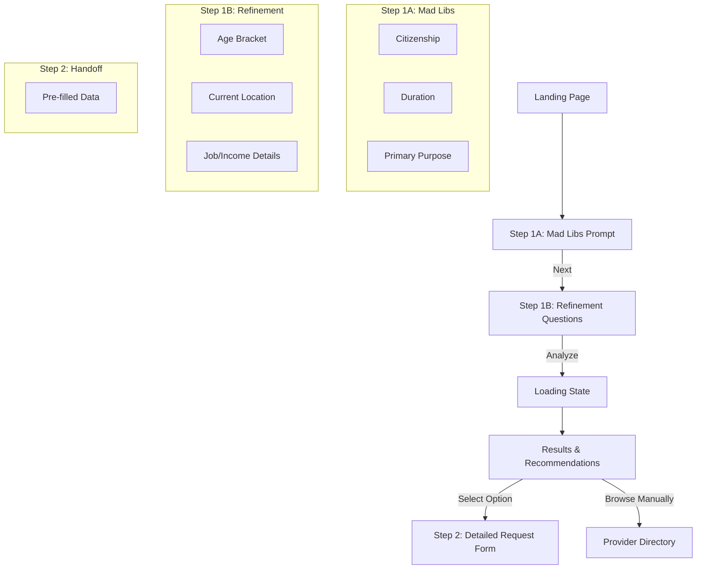

# Visa Eligibility Flow (Step 1 → Step 2 Bridge) Specification

## 1. Overview
This document specifies the design for the **Visa Eligibility Flow**, a lightweight, guided experience that helps users identify relevant visa options before committing to a detailed request. It serves as the bridge between landing on the site and submitting a formal request (Step 2).

## 2. User Flow Diagram



## 3. Screen-by-Screen Description

### Screen 1: The "Mad Libs" Prompt (Step 1A)
**Goal:** Low-friction entry point. Capture the "Big 3" data points.

*   **UI Elements:**
    *   Large, friendly typography.
    *   Sentence: "I am a **[Select Citizenship]** citizen wanting to stay in Thailand for **[Select Duration]** for **[Select Purpose]**."
    *   Primary CTA: "Check Eligibility" (Active only when all 3 filled).
*   **Data Collected:**
    *   `nationality` (ISO code)
    *   `durationPreference` (days/months/years)
    *   `purpose` (Tourism, Work, Retirement, Family, Education, Elite)
*   **Action:** Clicking CTA slides to Screen 2.

### Screen 2: Refinement Questions (Step 1B)
**Goal:** Gather just enough detail to filter edge cases.

*   **UI Elements:**
    *   **Profile Summary:** Small pill showing "FR • 12mo • Work" (reassures user).
    *   Progress indicator (Step 1 of 2).
    *   **Question 1: Age Bracket** (Pills: <20, 20-49, 50+)
    *   **Question 2: Where are you now?** (Radio: In Thailand / Outside Thailand)
    *   **Question 3: Country of Residence?** (Select: Same as Citizenship / Other)
        *   *Why:* Critical for document requirements.
    *   **Question 4 (Conditional):**
        *   If Purpose = Work: "Do you have a job offer?" (Yes/No)
        *   If Purpose = Retirement: "Monthly Income / Pension?" (<65k, 65k+, Lump Sum)
        *   If Purpose = Education: "Type of Study?" (Language School / University / Not Sure)
        *   If Purpose = Elite: "Budget Range?" (Standard / VIP)
*   **Primary CTA:** "See My Options"
*   **Data Collected:**
    *   `ageBracket`
    *   `currentLocation`
    *   `residenceCountry`
    *   `hasJobOffer` / `incomeBand` / `educationType`

### Screen 3: Recommendations (The "Payoff")
**Goal:** Build trust, educate, and funnel to Step 2.

*   **UI Elements:**
    *   **Header:** "We found [N] likely options for you."
    *   **Recommendation Cards (2-3 max):**
        *   **Badge:** "Best Match" / "Popular" / "Fastest"
        *   **Title:** Visa Name (e.g., "Non-Immigrant O-A")
        *   **Description:** 1-sentence plain English summary.
        *   **"Why this fits":** "Because you are over 50 and have a pension."
        *   **Metrics:** Cost Estimate, Time Estimate, Difficulty (Visual meter).
        *   **CTA:** "Select & Continue"
    *   **Secondary Action:** "None of these fit? Browse all providers."
*   **Action:** Clicking "Select & Continue" navigates to `/requests/new` (Step 2) with payload.

## 4. Data Contract (Step 1 → Step 2)

The following JSON object will be passed to the Request Form (via URL query params or React Context/State).

```typescript
interface EligibilityHandoff {
  // User Profile
  nationality: string;        // e.g., "FR", "US"
  residenceCountry: string;   // e.g., "FR", "SG" (New)
  ageBracket: string;         // "under_20", "20_49", "50_plus"
  currentLocation: string;    // "in_thailand", "outside_thailand"
  
  // Preferences
  durationPreference: string; // "30_days", "90_days", "1_year", "5_years", "forever"
  purpose: string;            // "tourism", "work", "retirement", "family", "education", "elite"
  intent?: string;            // "long_stay", "move_permanently", "test_waters" (New - Optional)
  
  // Conditional Details
  hasJobOffer?: boolean;
  incomeBand?: string;        // "below_65k", "above_65k", "lump_sum"
  educationType?: string;     // "language", "university" (New)
  
  // The Selected Path (if user clicked a specific card)
  selectedVisa?: {
    code: string;             // "NON_OA", "NON_B", "ELITE_GOLD"
    label: string;            // "Non-Immigrant O-A (Retirement)"
    category: string;         // "retirement"
  };
  
  // Context for the Request Form to display "Why"
  recommendationContext?: {
    matchReason: string;      // "Matches your age (50+) and income profile."
    estimatedCost: string;    // "25k-45k THB"
    estimatedTime: string;    // "3-4 weeks"
  };
}
```

## 5. Copy & Tone Guidelines

| Context | Do This (Neutral, Helpful) | Avoid This (Legal/Promissory) |
| :--- | :--- | :--- |
| **Results Header** | "Here are likely options based on your profile." | "You are eligible for these visas." |
| **Visa Description** | "Commonly used by retirees aged 50+." | "You qualify for this visa under Section 7." |
| **Cost Estimate** | "Est. Provider Fees: 20k-40k THB" | "Price: 20,000 THB" |
| **CTA** | "Start Request for this Visa" | "Apply Now" |
| **Disclaimer** | "Providers will verify your exact eligibility." | "Guaranteed Approval." |

## 6. Recommendation Logic (Simplified)

*   **Retirement (Non-O/O-A):**
    *   *Trigger:* Purpose=Retirement AND Age=50+
    *   *Why:* "You meet the age requirement (50+)."
*   **Work (Non-B):**
    *   *Trigger:* Purpose=Work AND JobOffer=Yes
    *   *Why:* "You have a sponsoring employer."
*   **Elite (Privilege):**
    *   *Trigger:* Purpose=Elite OR (Purpose=Long Stay AND Income=High)
    *   *Why:* "Hassle-free long term stay (5-20 years)."
*   **Education (Non-ED):**
    *   *Trigger:* Purpose=Education
    *   *Sub-logic:* If `educationType` = University -> "Non-ED (Uni)"; if Language -> "Non-ED (Language)"
    *   *Why:* "Learn Thai or study at a university."
*   **LTR (Long Term Resident):**
    *   *Trigger:* Income=High (>80k USD/yr equivalent)
    *   *Why:* "10-year visa for high potential individuals."

## 7. Implementation Plan

1.  **Frontend:** Create `EligibilityWizard` component in `apps/web`.
2.  **State Management:** Use `useReducer` or `Zustand` to hold wizard state.
3.  **Routing:**
    *   `/get-started` (The Wizard)
    *   `/requests/new` (The Form - accepts state)
4.  **Mock Data:** Hardcode the recommendation logic for MVP (no backend needed yet).
